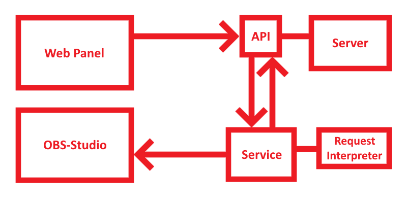

  

<h1 align="center">LiveDeck</h1>

  A web panel solution to control OBS-Studio

## About

  LiveDeck is an open-source multi account web panel solution for OBS-Studio. 
  The LiveDeck web interface allows fast interaction between the panel and the service, including OBS-Studio. 
  Through the script in the config file, the panel can be customized exactly to your usage.  
  

 
## Features
 - Panel Functions
   - Change Source Visibility
   - Change Source Filter Visibility
   - Change Scene
   - Mute Audio Source
 - Service Properties
   - Function Config Script
     - Static
     - Switch
     - Invert
   - Websocket Reconnect
   - API Connection

## Notes
- Keep in mind that the services for the server currently only support Linux.
- Make sure that the services have the necessary read and write permissions and are located in the home directory of the server.
- The panel template has to be placed in the PanelService under the directory "templates" (Example: "/home/test/PanelService/templates/mypanel").
- I recommend to put the admin panel under a subdomain.

 
There are some markings that need to be adjusted.

Examples:  
- `[your domain]` = example.com  
- `[your sub domain]` = test.example.com  

## Dependencies

### livedeck-service

| **Dependency** | **Description** | **Version** | **License**
| -------------- | --------------- | ----------- | -----------
 | [Newtonsoft.Json@^13.0.1](https://www.nuget.org/packages/Newtonsoft.Json) | Json.NET is a popular high-performance JSON framework for .NET| 13.0.1 | MIT
 | [obs-websocket-dotnet@^4.9.1](https://www.nuget.org/packages/obs-websocket-dotnet) | Official .NET library (written in C#) to communicate with an obs-websocket server| 4.9.1 | MIT

### Request Interpreter

| **Dependency** | **Description** | **Version** | **License**
| -------------- | --------------- | ----------- | -----------
 | [obs-websocket-dotnet@^4.9.1](https://www.nuget.org/packages/obs-websocket-dotnet) | Official .NET library (written in C#) to communicate with an obs-websocket server| 4.9.1 | MIT

### Authorization Service

| **Dependency** | **Description** | **Version** | **License**
| -------------- | --------------- | ----------- | -----------
 | [Newtonsoft.Json@^13.0.2-beta1](https://www.nuget.org/packages/Newtonsoft.Json) | Json.NET is a popular high-performance JSON framework for .NET| 13.0.2-beta1 | MIT
 | [MongoDB.Driver@^2.17.1](https://www.nuget.org/packages/MongoDB.Driver) | Official .NET driver for MongoDB| 2.17.1 | Apache2
 | [NetRoad@^1.0.0](https://www.nuget.org/packages/NetRoad) | A lightweight network library written in C#| 1.0.0 | MIT
 | [Isopoh.Cryptography.Argon2@^1.1.12](https://www.nuget.org/packages/Isopoh.Cryptography.Argon2) | Argon2 Password Hasher written in C#| 1.1.12 | CC BY 4.0

### Panel Service

| **Dependency** | **Description** | **Version** | **License**
| -------------- | --------------- | ----------- | -----------
 | [Newtonsoft.Json@^13.0.2-beta1](https://www.nuget.org/packages/Newtonsoft.Json) | Json.NET is a popular high-performance JSON framework for .NET| 13.0.2-beta1 | MIT

## Contributors

<td align="center">
  <a href="https://github.com/peakstack">
    
     
    
      <b>peakstack</b>
    
  </a>
</td>
